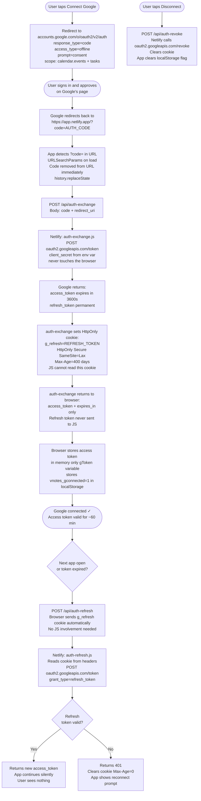

# Voice Notes — Technical Architecture

## Table of Contents

1. [Overview](#overview)
2. [Tech Stack](#tech-stack)
3. [System Architecture](#system-architecture)
4. [Core Pipeline: Voice → Classification → Execution](#core-pipeline)
5. [Authentication Architecture](#authentication-architecture)
6. [Data Model](#data-model)
7. [Netlify Serverless Functions](#netlify-serverless-functions)
8. [Storage Strategy](#storage-strategy)
9. [Classification Logic](#classification-logic)
10. [Google API Integration](#google-api-integration)
11. [Security Model](#security-model)
12. [File Structure](#file-structure)

---

## Overview

Voice Notes is a Progressive Web App (PWA) that records voice input, transcribes it using OpenAI Whisper, classifies it using GPT-4o-mini, and automatically pushes structured data to Google Calendar or Google Tasks. It is hosted on Netlify, installable on iOS via Safari "Add to Home Screen," and designed to feel like a native mobile app with persistent authentication.

The app has no traditional backend or database. All user data lives on-device in `localStorage`. The only server-side component is a thin set of three Netlify serverless functions that exist solely to protect the Google OAuth client secret.

---

## Tech Stack

| Layer | Technology | Purpose |
|---|---|---|
| Frontend | Vanilla HTML/CSS/JS (single file) | UI, recording, pipeline orchestration |
| Hosting | Netlify | Static hosting + serverless functions |
| Voice recording | Web MediaRecorder API | Captures audio on device |
| Transcription | OpenAI Whisper (`whisper-1`) | Speech-to-text |
| Classification | OpenAI GPT-4o-mini | Structured JSON classification |
| Calendar integration | Google Calendar REST API v3 | Creates calendar events |
| Tasks integration | Google Tasks REST API v1 | Creates tasks with due dates |
| Auth (OAuth) | Google OAuth 2.0 Authorization Code Flow | Persistent Google login |
| Token security | Netlify Functions + HttpOnly cookies | Keeps client secret off the browser |
| Persistence | Browser `localStorage` | Notes, API key, connection flag |
| PWA | Web App Manifest + apple-mobile-web-app meta tags | iOS home screen install |

---

## System Architecture

```
┌─────────────────────────────────────────────────────────────────┐
│                        USER'S DEVICE (iOS Safari / PWA)         │
│                                                                  │
│  ┌─────────────────────────────────────────────────────────┐   │
│  │                     index.html                           │   │
│  │                                                          │   │
│  │  ┌──────────┐   ┌───────────┐   ┌────────────────────┐ │   │
│  │  │ MediaRec- │   │  OpenAI   │   │    GPT-4o-mini     │ │   │
│  │  │ order API │   │  Whisper  │   │  Classifier        │ │   │
│  │  │ (browser) │   │  API      │   │                    │ │   │
│  │  └──────────┘   └───────────┘   └────────────────────┘ │   │
│  │                                                          │   │
│  │  ┌──────────────────────────────────────────────────┐   │   │
│  │  │              localStorage                         │   │   │
│  │  │  vnotes_v2 | vnotes_apikey | vnotes_gconnected   │   │   │
│  │  └──────────────────────────────────────────────────┘   │   │
│  └─────────────────────────────────────────────────────────┘   │
│                          │  /api/*                               │
└──────────────────────────┼──────────────────────────────────────┘
                           │
┌──────────────────────────▼──────────────────────────────────────┐
│                      NETLIFY EDGE                                │
│                                                                  │
│   [[redirects]]: /api/* → /.netlify/functions/:splat            │
│                                                                  │
│  ┌──────────────┐  ┌──────────────┐  ┌──────────────────────┐  │
│  │ auth-exchange│  │ auth-refresh │  │    auth-revoke       │  │
│  │              │  │              │  │                      │  │
│  │ Exchanges    │  │ Reads cookie,│  │ Revokes token,       │  │
│  │ ?code= for   │  │ returns new  │  │ clears cookie        │  │
│  │ tokens.      │  │ access token │  │                      │  │
│  │ Sets HttpOnly│  │              │  │                      │  │
│  │ cookie       │  │              │  │                      │  │
│  └──────┬───────┘  └──────┬───────┘  └──────────────────────┘  │
│         │                 │          Env vars:                   │
│         │                 │          GOOGLE_CLIENT_ID            │
│         │                 │          GOOGLE_CLIENT_SECRET        │
└─────────┼─────────────────┼──────────────────────────────────────┘
          │                 │
┌─────────▼─────────────────▼──────────────────────────────────────┐
│                     GOOGLE SERVICES                               │
│                                                                   │
│  ┌─────────────────┐  ┌──────────────┐  ┌─────────────────────┐ │
│  │  OAuth 2.0      │  │  Calendar    │  │  Tasks API v1       │ │
│  │  Token Endpoint │  │  API v3      │  │                     │ │
│  │  oauth2.google  │  │  (events)    │  │  (tasks + due date) │ │
│  └─────────────────┘  └──────────────┘  └─────────────────────┘ │
└───────────────────────────────────────────────────────────────────┘
```

---

## Core Pipeline

This is the full journey from tapping the microphone to a note appearing in Google Calendar or Tasks.

```mermaid
flowchart TD
    A([User taps record button]) --> B[Browser requests microphone\npermission via getUserMedia]
    B --> C{Permission\ngranted?}
    C -- No --> ERR1[Show error:\nAllow mic in Settings → Safari]
    C -- Yes --> D[MediaRecorder starts\ncapturing audio chunks\nevery 100ms]
    D --> E([User taps stop button])
    E --> F[MediaRecorder.stop called\nStream tracks released\nBlob assembled from chunks]

    F --> G{MIME type\ndetection}
    G --> G1[iOS Safari → audio/mp4\nChrome → audio/webm\nFirefox → audio/ogg]
    G1 --> H[File extension assigned\nm4a / webm / ogg]

    H --> I[/STEP 1: TRANSCRIPTION\nPOST openai.com/v1/audio/transcriptions\nmodel: whisper-1\nfile: audio blob + filename/]

    I --> J{Whisper\nresponse}
    J -- Error / empty --> ERR2[Show error to user\nReset UI]
    J -- Transcript text --> K[Raw transcript string]

    K --> L[/STEP 2: CLASSIFICATION\nPOST openai.com/v1/chat/completions\nmodel: gpt-4o-mini\nresponse_format: json_object/]

    L --> M{GPT-4o-mini\nclassification}

    M --> N{type?}

    N -- calendar --> O[Calendar object:\ntitle, date, time,\ndescription, location]
    N -- todo --> P[Todo object:\ntask, due date or null,\nnotes]

    O --> Q[capFirst applied to title]
    P --> R[capFirst applied to task]

    Q --> S[Note saved to localStorage\nwith id, createdAt, transcript]
    R --> S

    S --> T[UI updated:\nlast card shown,\nnotes list re-rendered]

    T --> U{Google\nconnected?}
    U -- No --> DONE([Done — note saved locally only])

    U -- Yes --> V[ensureGoogleToken called]
    V --> W{Access token\nvalid?}
    W -- Yes --> X
    W -- No --> V2[POST /api/auth-refresh\nbrowser sends HttpOnly cookie automatically]
    V2 --> W2{Refresh\nsucceeded?}
    W2 -- No --> ERR3[Show reconnect prompt\nClear gconnected flag]
    W2 -- Yes --> X

    X{note type?}

    X -- calendar --> Y[/STEP 3A: GOOGLE CALENDAR\nPOST googleapis.com/calendar/v3/\ncalendars/primary/events\nAuthorization: Bearer access_token/]
    X -- todo --> Z[/STEP 3B: GOOGLE TASKS\nPOST tasks.googleapis.com/tasks/v1/\nlists/@default/tasks\ntitle + due RFC3339 + notes/]

    Y --> AA[Google Calendar event created\nEvent ID stored in note.googleId]
    Z --> AB[Google Task created\nTask ID stored in note.googleId]

    AA --> DONE2([Done ✓ Badge shown])
    AB --> DONE2
```



---

## Authentication Architecture

Google OAuth uses the full **Authorization Code Flow with refresh tokens**, not the deprecated implicit flow. This is what enables persistent login — the user never needs to re-authenticate unless they explicitly disconnect.



### Why HttpOnly cookies?

The Google client secret cannot live in frontend JavaScript — it would be visible to anyone who views source. Netlify serverless functions run in Node.js on the server, where `process.env.GOOGLE_CLIENT_SECRET` is never exposed to the browser. The refresh token is stored in a `HttpOnly` cookie, which means JavaScript on the page cannot read it even if there were an XSS vulnerability — only the browser sends it automatically with requests to the same origin.

On iOS 16.4+, HttpOnly cookies are shared between Safari and the installed PWA for the same origin, which is what enables the "never log in again" experience.

---

## Data Model

Each note stored in `localStorage` under key `vnotes_v2` is a JSON array of note objects:

### Calendar Note

```json
{
  "id": 1713820800000,
  "createdAt": "2026-04-22T18:00:00.000Z",
  "transcript": "Dentist appointment Thursday at 2pm on Main Street",
  "type": "calendar",
  "calendar": {
    "title": "Dentist appointment",
    "date": "2026-04-24",
    "time": "14:00",
    "description": null,
    "location": "Main Street"
  },
  "todo": {
    "task": "Dentist appointment",
    "due": null,
    "notes": null
  },
  "googleId": "abc123xyz_calendar_event_id"
}
```

### Todo Note

```json
{
  "id": 1713820900000,
  "createdAt": "2026-04-22T18:01:00.000Z",
  "transcript": "Work on the quarterly report tonight",
  "type": "todo",
  "calendar": {
    "title": null,
    "date": null,
    "time": null,
    "description": null,
    "location": null
  },
  "todo": {
    "task": "Work on the quarterly report",
    "due": "2026-04-22",
    "notes": "Tonight"
  },
  "googleId": "task_id_from_google_tasks_api"
}
```

### Key Fields

| Field | Type | Notes |
|---|---|---|
| `id` | number | `Date.now()` timestamp, used as unique key |
| `createdAt` | ISO 8601 string | Full datetime of recording |
| `transcript` | string | Raw Whisper output, unmodified |
| `type` | `"calendar"` or `"todo"` | Set by GPT classifier |
| `calendar.date` | `YYYY-MM-DD` or null | |
| `calendar.time` | `HH:MM` 24h or null | If null, event is all-day |
| `todo.due` | `YYYY-MM-DD` or null | Null when no time reference given |
| `todo.notes` | string or null | Plain-English timing context |
| `googleId` | string or null | Google Calendar event ID or Task ID, stored after successful push, used for edit sync |

---

## Netlify Serverless Functions

All three functions follow the same pattern: read from `event.headers.cookie` or `event.body`, make a server-side request to Google with the secret, return a response.

### `auth-exchange.js`

- **Trigger**: Called once after the OAuth redirect with `?code=`
- **Input**: `{ code, redirect_uri }` from POST body
- **Action**: POSTs to `oauth2.googleapis.com/token` with `grant_type=authorization_code`
- **Output**: Sets `g_refresh` HttpOnly cookie, returns `{ access_token, expires_in }` to browser
- **Secret used**: `GOOGLE_CLIENT_SECRET`

### `auth-refresh.js`

- **Trigger**: Called on every app open if previously connected, and whenever `ensureGoogleToken()` finds the access token expired
- **Input**: `g_refresh` HttpOnly cookie (sent automatically by browser)
- **Action**: POSTs to `oauth2.googleapis.com/token` with `grant_type=refresh_token`
- **Output**: Returns `{ access_token, expires_in }` or 401 with `Max-Age=0` cookie clear
- **Secret used**: `GOOGLE_CLIENT_SECRET`

### `auth-revoke.js`

- **Trigger**: Called when user taps "Disconnect Google"
- **Input**: `g_refresh` HttpOnly cookie
- **Action**: POSTs to `oauth2.googleapis.com/revoke` to invalidate the token server-side
- **Output**: Returns `Set-Cookie: g_refresh=; Max-Age=0` to clear the cookie

### Routing

Netlify functions are natively accessible at `/.netlify/functions/[name]`. The `netlify.toml` adds a redirect rule so the frontend can use the cleaner `/api/[name]` path:

```toml
[[redirects]]
  from = "/api/*"
  to = "/.netlify/functions/:splat"
  status = 200
```

---

## Storage Strategy

| Data | Location | Accessible to JS | Persists across sessions |
|---|---|---|---|
| OpenAI API key | `localStorage` (`vnotes_apikey`) | Yes | Yes |
| Notes array | `localStorage` (`vnotes_v2`) | Yes | Yes |
| Google connection flag | `localStorage` (`vnotes_gconnected`) | Yes | Yes |
| Google access token | JS memory (`gToken` variable) | Yes | No — cleared on page close |
| Google refresh token | HttpOnly cookie (`g_refresh`) | **No** | Yes — 400 days |
| Google client secret | Netlify env var | **No** | N/A — server only |

The access token is intentionally kept only in memory (not `localStorage`). This means on every app open, `silentRefresh()` is called to get a fresh access token using the HttpOnly cookie. This is slightly slower but means a stolen `localStorage` dump cannot be used to make Google API calls.

---

## Classification Logic

GPT-4o-mini receives a system prompt on every recording that includes:

1. **Today's date and day of week** — resolved from `new Date()` at recording time, so relative expressions like "next Monday" resolve to actual dates
2. **Strict classification rules** — calendar events require a specific time OR explicit "add to calendar" phrasing; everything else is a todo
3. **Due date rules** — any time reference ("tonight", "this week", "by Friday") sets a due date; truly open tasks with no time mention get `null`
4. **Output schema** — enforced via `response_format: { type: 'json_object' }` to guarantee parseable JSON

### Classification Decision Tree

```
Voice note transcript
        │
        ▼
Does it mention a specific time (e.g. "3pm", "at noon")?
        │
    Yes ├──── AND does it mention a specific date? ──── Yes ──→ CALENDAR (timed event)
        │
    No  └──── Does the user say "add to calendar" / "put on my calendar"?
                    │
                Yes └──────────────────────────────────────────→ CALENDAR (all-day event)
                    │
                No  └──────────────────────────────────────────→ TODO
                                                                    │
                                                         Does it mention any time?
                                                                    │
                                                           Yes ──→ Set due date
                                                           No  ──→ due: null
```

### Google Tasks Due Date Mapping

| User says | Due date set to |
|---|---|
| "tonight" / "today" | Today |
| "tomorrow" | Tomorrow |
| "this week" / "by Friday" | This Friday |
| "next week" | Next Monday |
| "soon" / "ASAP" / "urgent" | Today |
| No time reference | `null` |

---

## Google API Integration

### Calendar Event creation

`POST https://www.googleapis.com/calendar/v3/calendars/primary/events`

```json
{
  "summary": "Dentist appointment",
  "start": { "dateTime": "2026-04-24T14:00:00", "timeZone": "America/New_York" },
  "end":   { "dateTime": "2026-04-24T15:00:00", "timeZone": "America/New_York" },
  "description": "...",
  "location": "Main Street"
}
```

- If no time provided, `start`/`end` use `date` (string) instead of `dateTime` → all-day event
- End time defaults to 1 hour after start
- Timezone resolved from `Intl.DateTimeFormat().resolvedOptions().timeZone` on device

### Task creation

`POST https://tasks.googleapis.com/tasks/v1/lists/@default/tasks`

```json
{
  "title": "Work on quarterly report",
  "due": "2026-04-22T00:00:00.000Z",
  "notes": "Tonight"
}
```

- `due` must be RFC 3339 format; Google Tasks ignores the time component (always midnight UTC)
- Tasks with earlier due dates surface higher in Gmail sidebar and Google Tasks app automatically
- `notes` field appears as a description under the task title

### Editing (PATCH)

When a note title is edited in-app, a `PATCH` request is sent to the appropriate API using the stored `googleId`:

- **Calendar**: `PATCH .../calendars/primary/events/{googleId}` with `{ "summary": newTitle }`
- **Tasks**: `PATCH .../lists/@default/tasks/{taskId}` with `{ "title": newTitle }`

---

## Security Model

| Threat | Mitigation |
|---|---|
| Client secret exposure | Lives only in Netlify env var, never in browser JS or source code |
| Refresh token theft via XSS | HttpOnly cookie — JS cannot read it |
| Refresh token theft via network | Secure flag — HTTPS only |
| CSRF on Netlify functions | SameSite=Lax cookie — not sent on cross-site requests |
| OpenAI key exposure | Stored in localStorage, never sent to our servers. User is responsible for key rotation if device is compromised. |
| OAuth code interception | Single-use codes, HTTPS only, code removed from URL immediately via `history.replaceState` |

---

## File Structure

```
notes_app/
├── index.html                      # Entire frontend — UI, recording, pipeline, OAuth
├── manifest.json                   # PWA manifest (display: standalone, theme_color)
├── privacy.html                    # Privacy policy (required for Google OAuth verification)
├── netlify.toml                    # Build config + /api/* redirect rule
├── ARCHITECTURE.md                 # This document
├── netlify/
│   └── functions/
│       ├── auth-exchange.js        # OAuth code → tokens, sets HttpOnly cookie
│       ├── auth-refresh.js         # Cookie → new access token
│       └── auth-revoke.js          # Revoke token, clear cookie
├── .gitignore
└── NotesApp/                       # Legacy Swift files (unused)
```
